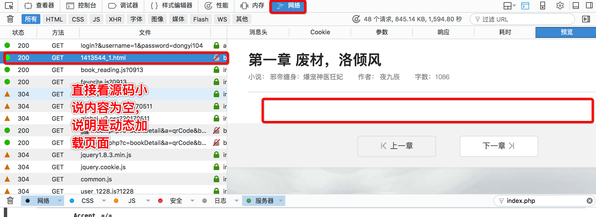
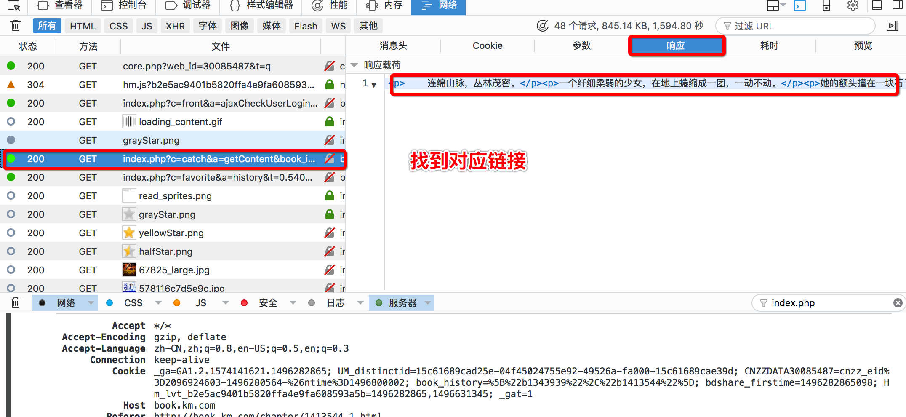
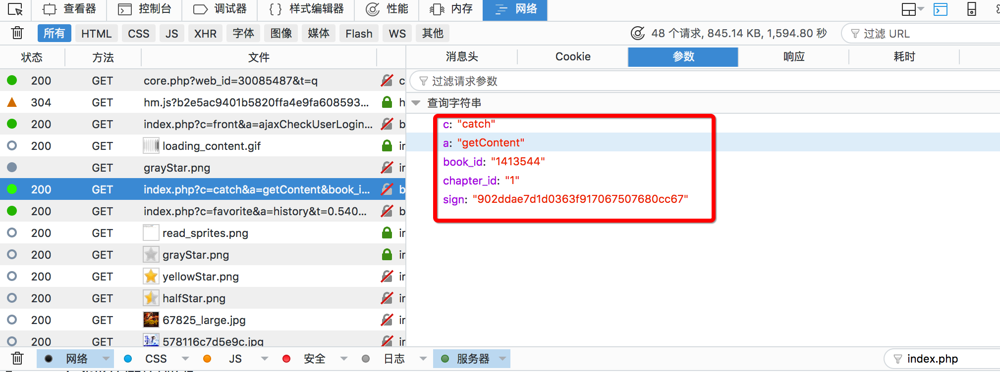

* content
{:toc}

1> 打开页面，观察是否是动态加载页面

2> 查找隐藏的加载内容部分的链接

3> 找到链接所需要的对应的链接的参数

4> 在网页源码中找到对应的参数

5> 从源码中正则提取相关参数
```py
sign = re.search(r'RP.sign = "(.*?)";', html, re.M | re.I)
book_id = re.search(r'book_id":"(.*?)",', html, re.M | re.I)
if sign:
　　print 'book_id', book_id.group(1)
　　print 'sign', sign.group(1)
else:
　　print 'no match'
```
6> 拼接隐藏链接
```py
contentURL = 'http://book.km.com/index.php?c=catch&a=getContent&book_id=%s&chapter_id=1&sign=%s' % (book_id.group(1), sign.group(1))
```
7> 开始正式的抓取页面中的数据
```py
#!/usr/bin/python
#-*- coding: utf-8 -*-
#encoding=utf-8


# 统一用于上传的方法打包

import requests
import htmllib
import re
import urllib2
import json
import leancloud
import codecs
import string
from bs4 import BeautifulSoup
from lxml import etree
import sys
reload(sys)
sys.setdefaultencoding('utf8')


class bookcom:
    NovelName = ''
    NovelImageUrl = ''
    NovelType = ''
    NovelChapter = ''
    NovelChapterContent = ''
    NovelChapterId = ''

    # 获取小说列表
    def bookcomGetList(self):
        html = requests.get('http://book.km.com/shuku_0_0_0_1_0_0_1.html')
        pythonEtree = etree.HTML(html.text)
        pythonLink = pythonEtree.xpath('//div[@class="imgbox"]/a')
        for each in pythonLink:
            # print each.xpath('img/@_src')[0]
            # print each.xpath('img/@alt')[0]
            # print each.xpath('@href')[0]
            self.NovelName = each.xpath('img/@alt')[0]
            self.NovelImageUrl = each.xpath('img/@_src')[0]
            self.NovelType = '免费'

            searchObjOne = re.search(r'/shuku/(.*?).html', each.xpath('@href')[0], re.M | re.I | re.S)
            # print searchObjOne.group(1)
            URLTwo = 'http://book.km.com/chapterlist/%s.html' % searchObjOne.group(1)
            # print URLTwo
            # 保存图片列表
            self.bookcomGetListSave()
            self.bookcomGetNovelList(URLTwo)

    # 获取章节链接
    def bookcomGetNovelList(self,URL):
        html = requests.get(URL, 'GET')
        # print html.text
        pythonEtree = etree.HTML(html.text)
        pythonLink = pythonEtree.xpath('//ul[@class="catalog_list clearfix"]/li/a')

        for each in pythonLink:
            # print each.xpath('@href')[0]
            # print each.xpath('text()')[0]
            self.NovelChapter = each.xpath('text()')[0]
            novelContentUrl = 'http://book.km.com%s' % each.xpath('@href')[0]
            # print novelContentUrl
            self.bookcomGetNovelContent(novelContentUrl, URL)

    # 获取章节内容
    def bookcomGetNovelContent(self, URL, SuperURl):
        # ********** 根据表面链接获取所有源码 **********
        headers = {'User-Agent': 'Mozilla/5.0 (Macintosh; Intel Mac OS X 10.12; rv:53.0) Gecko/20100101 Firefox/53.0',
                   'Accept': 'text/html,application/xhtml+xml,application/xml;q=0.9,*/*;q=0.8',
                   'Cookie': 'HTTP_REFERER=book.km.com; _ga=GA1.2.1574141621.1496282865; UM_distinctid=15c61689cad25e-04f45024755e92-49526a-fa000-15c61689cae39d; CNZZDATA30085487=cnzz_eid%3D2096924603-1496280564-%26ntime%3D1496291364; book_history=%5B%22b1343939%22%2C%22b1413544%22%5D; bdshare_firstime=1496282865098; Hm_lvt_b2e5ac9401b5820ffa4e9fa608593a5b=1496282865; Hm_lpvt_b2e5ac9401b5820ffa4e9fa608593a5b=1496296670; HTTP_REFERER=book.km.com',
                   'Referer': SuperURl
            , 'Accept-Language': 'zh-CN,zh;q=0.8,en-US;q=0.5,en;q=0.3'
            , 'Connection': 'keep-alive'
            , 'Accept-Encoding': 'gzip, deflate'
            , 'Host': 'book.km.com'
            , 'Upgrade-Insecure-Requests': '1'
            , 'Cache-Control': 'max-age=0'
                   }

        html = requests.get(URL, headers=headers)
        # print html.text
        # 在源码中抓取需要的参数
        sign = re.search(r'RP.sign = "(.*?)";', html.text, re.M | re.I)
        book_id = re.search(r'book_id":"(.*?)",', html.text, re.M | re.I)
        chapter_id = re.search(r'"id":"(.*?)",', html.text, re.M | re.I)
        self.NovelChapterId = chapter_id.group(1)
        # if sign:
        #     print 'book_id', book_id.group(1)
        #     print 'sign', sign.group(1)
        #     print 'chapter_id', chapter_id.group(1)
        # else:
        #     print 'no match'

        contentHeader = {
            'Accept': '*/*'
            , 'Accept-Encoding': 'gzip, deflate'
            , 'Accept-Language': 'zh-CN,zh;q=0.8,en-US;q=0.5,en;q=0.3'
            , 'Connection': 'keep-alive'
            ,
            'Cookie': '_ga=GA1.2.1574141621.1496282865; UM_distinctid=15c61689cad25e-04f45024755e92-49526a-fa000-15c61689cae39d; CNZZDATA30085487=cnzz_eid%3D2096924603-1496280564-%26ntime%3D1496800002; book_history=%5B%22b1343939%22%2C%22b1413544%22%5D; bdshare_firstime=1496282865098; Hm_lvt_b2e5ac9401b5820ffa4e9fa608593a5b=1496282865,1496631345; _gat=1'
            , 'Host': 'book.km.com'
            , 'Referer': URL
            , 'User-Agent': 'Mozilla/5.0 (Macintosh; Intel Mac OS X 10.12; rv:53.0) Gecko/20100101 Firefox/53.0'
            , 'X-Requested-With': 'XMLHttpRequest'
        }

        # 拼接隐藏接口
        # print 'http://book.km.com/index.php?c=catch&a=getContent&book_id=%s&chapter_id=1&sign=%s' % (
        # book_id.group(1), sign.group(1))
        contentURL = 'http://book.km.com/index.php?c=catch&a=getContent&book_id=%s&chapter_id=%s&sign=%s' % (
        book_id.group(1), chapter_id.group(1), sign.group(1))
        contentHtml = requests.get(contentURL, headers=contentHeader)
        self.NovelChapterContent = contentHtml.text

        print self.NovelName
        print self.NovelImageUrl
        print self.NovelType
        print self.NovelChapter
        print self.NovelChapterId
        print self.NovelChapterContent
        self.bookcomChapterSave()

        # 获取小说内容
        # print contentHtml.text

    def bookcomChapterSave(self):
        Todo = leancloud.Object.extend('XuanHuanContent')
        todo = Todo()
        todo.set('NovelName', self.NovelName)
        todo.set('NovelChapterId', self.NovelChapterId)
        todo.set('NovelChapter', self.NovelChapter)
        todo.set('NovelChapterContent', self.NovelChapterContent)
        todo.save()

    def bookcomGetListSave(self):
        Todo = leancloud.Object.extend('XuanHuanList')
        todo = Todo()
        todo.set('NovelImageUrl', self.NovelImageUrl)
        todo.set('NovelType', self.NovelType)
        todo.set('NovelName', self.NovelName)
        todo.save()

leancloud.init("", "")
Book = bookcom()
Book.bookcomGetList()
# Book.bookcomGetNovelList('http://book.km.com/chapterlist/940750.html')
```
